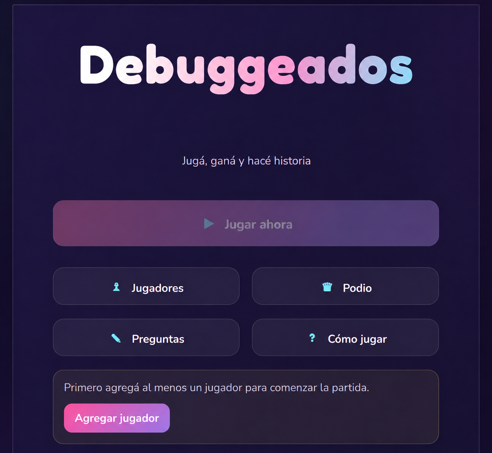
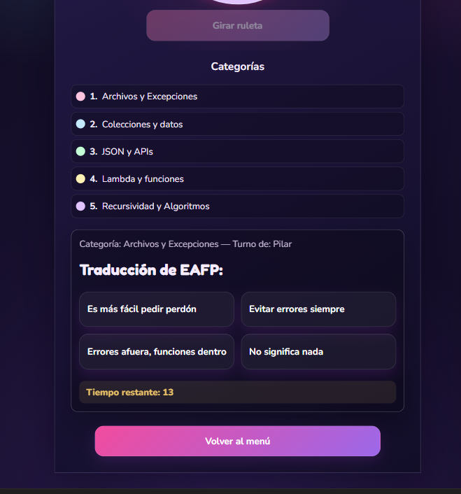
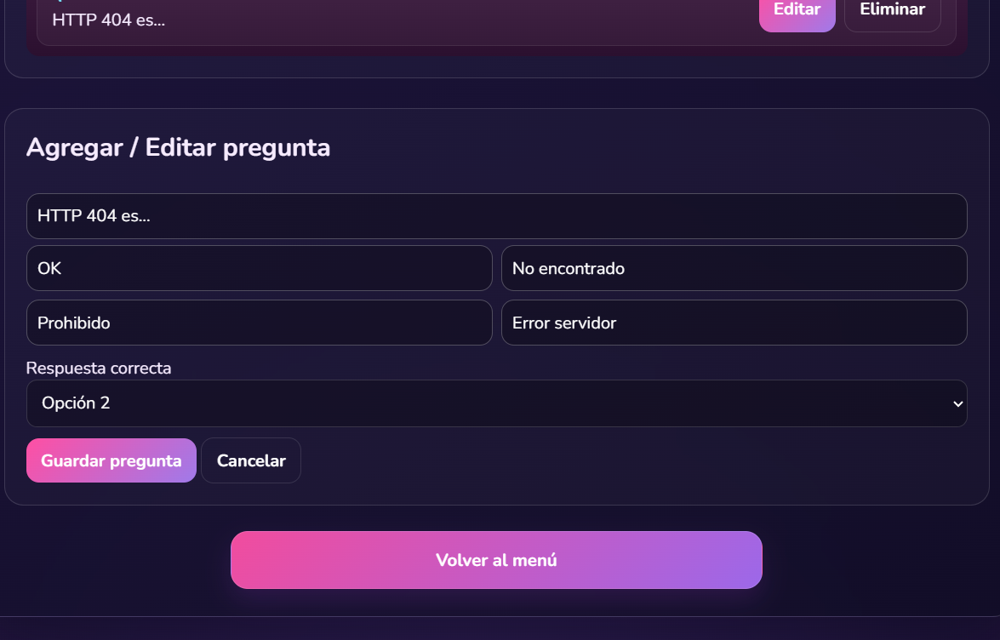

# Debuggeados — Preguntados

Juego web Full Stack desarrollado individualmente como proyecto académico para **Programación III**.

El proyecto comenzó como una aplicación de preguntas y respuestas inspirada en juegos como Preguntados y Kahoot, con el objetivo de aplicar conceptos de programación, lógica, programación orientada a objetos, estructuras de datos, APIs REST y persistencia de información.

Tiempo después de finalizar la materia decidí retomarlo como proyecto de portfolio, refactorizando partes del código, corrigiendo funcionalidades y realizando un rediseño completo de la experiencia visual.

---

## Vista de la aplicación

### Versión actual

La versión actual mantiene la lógica y los conceptos principales del proyecto original, pero incorpora una nueva identidad visual y mejoras en la experiencia de usuario.



<table>
  <tr>
    <td width="50%">
      <strong>Juego y sistema de preguntas</strong><br><br>
      
    </td>
    <td width="50%">
      <strong>Administración de preguntas</strong><br><br>
      
    </td>
  </tr>
</table>

<!-- Cuando tengas la captura nueva del podio podés agregarla acá:

### Podio y estadísticas


-->

---

## Mi desarrollo

Desarrollé el proyecto de forma integral, trabajando tanto en frontend como en backend.

Entre las principales tareas realizadas se encuentran:

- Desarrollo frontend con HTML, CSS y JavaScript.
- Backend desarrollado con Python y FastAPI.
- Diseño e implementación de APIs REST.
- Desarrollo de la lógica principal del juego.
- Sistema de jugadores y turnos.
- Ruleta de categorías.
- CRUD de preguntas.
- Persistencia mediante archivos JSON.
- Sistema de puntajes.
- Estadísticas de partida.
- Programación Orientada a Objetos.
- Modularización del backend.
- Integración frontend-backend.
- Diseño y desarrollo de la interfaz.
- Testing automatizado con Pytest.
- Control de versiones con Git y GitHub.
- Preparación del proyecto para despliegue web.

---

## Rediseño y refactorización

Tiempo después de finalizar el proyecto académico decidí volver a trabajar sobre Debuggeados aplicando conocimientos adquiridos posteriormente.

El objetivo no fue reemplazar el proyecto original, sino utilizarlo como ejercicio de **mejora continua**.

La nueva etapa incluyó:

- Rediseño completo de la interfaz.
- Nueva identidad visual inspirada en juegos de trivia.
- Mejor jerarquía visual y organización de las pantallas.
- Mejoras de espaciado y composición.
- Diseño responsive para desktop, tablet y mobile.
- Mejor experiencia en jugadores, preguntas, ruleta y podio.
- Validación para impedir iniciar partidas sin jugadores.
- Corrección de errores detectados durante el recorrido completo del juego.
- Mejoras en la gestión de jugadores.
- Mejoras en el sistema de preguntas.
- Revisión de puntajes y estadísticas.
- Ampliación de las pruebas automatizadas.
- Limpieza y reorganización del código.
- Preparación para un nuevo despliegue web.

Volver al proyecto tiempo después también me permitió identificar decisiones de código y diseño que hoy resolvería de otra manera.

---

## Evolución del proyecto

Una de las partes más importantes de Debuggeados fue su evolución.

El proyecto no nació directamente como una aplicación web.

### Primera etapa — lógica del juego

La primera versión estuvo enfocada principalmente en conseguir que funcionara la lógica: jugadores, preguntas, categorías, respuestas y puntajes.

A medida que el proyecto crecía también aparecieron problemas de organización, responsabilidades poco claras y dificultades para mantener el código.

### Segunda etapa — Tkinter

Posteriormente desarrollé una interfaz utilizando **Tkinter**.

El juego comenzaba a tomar forma visualmente, aunque todavía existían problemas relacionados con la interfaz, la ruleta, la persistencia de cambios y la organización de la lógica.

### Tercera etapa — Pygame

También experimenté con **Pygame** buscando una interfaz más dinámica.

Esta etapa permitió probar otro enfoque visual, pero finalmente surgió una nueva necesidad: poder acceder al juego directamente desde un navegador.

### Cuarta etapa — aplicación web

La siguiente versión transformó el proyecto en una aplicación web.

Se incorporaron:

- HTML.
- CSS.
- JavaScript.
- Python.
- FastAPI.
- APIs REST.
- JSON.
- CRUD.
- Separación entre frontend y backend.

### Versión original web

La siguiente interfaz corresponde a la primera versión web desarrollada durante Programación III.


<table>
  <tr>
    <td width="50%">
      <strong>Juego original</strong><br><br>
      
    </td>
    <td width="50%">
      <strong>Podio original</strong><br><br>
      
    </td>
  </tr>
</table>

> La versión original representa los conocimientos y herramientas que manejaba al momento de desarrollar el proyecto para Programación III. Volver a trabajar sobre ella tiempo después me permitió observar de forma concreta cuánto había aprendido y qué decisiones hoy resolvería de otra manera.

---

## Tecnologías

### Frontend

- HTML
- CSS
- JavaScript

### Backend

- Python
- FastAPI
- Uvicorn

### API

- REST

### Persistencia

- JSON

### Testing

- Pytest

### Herramientas

- Git
- GitHub
- Visual Studio Code

---

## Funcionalidades principales

El juego permite:

- Agregar jugadores.
- Editar jugadores.
- Eliminar jugadores.
- Iniciar partidas.
- Gestionar turnos.
- Girar una ruleta de categorías.
- Mostrar preguntas según la categoría seleccionada.
- Responder preguntas con cuatro opciones.
- Utilizar un temporizador por pregunta.
- Validar respuestas.
- Calcular puntajes automáticamente.
- Consultar un podio final.
- Visualizar estadísticas de la partida.
- Administrar el banco de preguntas.
- Crear preguntas.
- Editar preguntas.
- Eliminar preguntas.
- Consultar instrucciones del juego.

La aplicación también impide iniciar una partida mientras no exista al menos un jugador registrado.

---

## Categorías

El banco de preguntas está organizado en diferentes categorías relacionadas con contenidos de programación:

1. **Archivos y Excepciones**
2. **Colecciones y datos**
3. **JSON y APIs**
4. **Lambda y funciones**
5. **Recursividad y Algoritmos**

Cada categoría se representa visualmente dentro de la ruleta y determina el conjunto de preguntas disponibles durante la partida.

---

## Arquitectura del proyecto

El proyecto separa frontend, backend y persistencia para mantener responsabilidades claras.

```text
Frontend
   │
   │ HTTP / REST
   ▼
FastAPI
   │
   ├── lógica del juego
   ├── jugadores
   ├── preguntas
   ├── puntajes
   └── estadísticas
   │
   ▼
Persistencia JSON
```

El backend se encuentra modularizado en distintos archivos:

```text
backend/
├── models.py
├── storage.py
├── game.py
└── main.py
```

### `models.py`

Define las principales entidades utilizadas por la aplicación.

### `storage.py`

Gestiona la lectura, escritura y persistencia de información.

### `game.py`

Contiene la lógica relacionada con partidas, preguntas, turnos, respuestas y puntajes.

### `main.py`

Expone los endpoints mediante FastAPI y conecta las distintas partes de la aplicación.

---

## Estructura del proyecto

```text
.
├── backend/
│   ├── main.py
│   ├── models.py
│   ├── game.py
│   └── storage.py
│
├── data/
│   └── questions.json
│
├── frontend/
│   ├── index.html
│   ├── add_players.html
│   ├── game.html
│   ├── admin_questions.html
│   ├── instructions.html
│   ├── podium.html
│   ├── app.js
│   ├── menu.js
│   ├── players.js
│   ├── game.js
│   ├── podium.js
│   └── styles.css
│
├── docs/
│   └── screenshots/
│
├── tests/
│
├── requirements.txt
├── railway.toml
├── vercel.json
├── .gitignore
└── README.md
```

---

## API REST

El frontend se comunica con el backend mediante diferentes endpoints.

### Jugadores

```text
GET    /api/players
POST   /api/players
PUT    /api/players/{id}
DELETE /api/players/{id}
```

### Categorías

```text
GET /api/categories
```

### Juego

```text
POST /api/spin
POST /api/answer
```

### Resultados

```text
GET /api/podium
```

El backend gestiona la información utilizada durante la partida y devuelve los datos necesarios al frontend en formato JSON.

---

## CRUD de preguntas

El proyecto incluye un sistema para administrar el banco de preguntas.

### Create

Permite agregar una nueva pregunta especificando:

- texto;
- categoría;
- cuatro opciones;
- respuesta correcta.

### Read

Permite consultar las preguntas existentes y organizarlas según sus categorías.

### Update

Permite modificar preguntas, opciones y respuestas correctas.

### Delete

Permite eliminar preguntas existentes del banco.

---

## Programación Orientada a Objetos

Durante el desarrollo se aplicaron conceptos de Programación Orientada a Objetos para organizar las entidades y responsabilidades del sistema.

Entre las principales entidades utilizadas se encuentran:

- jugadores;
- preguntas;
- categorías;
- partidas.

Esto permitió separar la lógica del juego de la interfaz y mejorar la organización general del backend.

---

## Testing

El backend cuenta con pruebas automatizadas desarrolladas con **Pytest**.

Las pruebas permiten comprobar distintos comportamientos del sistema, incluyendo:

- gestión de jugadores;
- operaciones sobre preguntas;
- persistencia;
- ruleta;
- respuestas;
- puntajes;
- estadísticas.

Para ejecutar los tests:

```bash
python -m pytest -q
```

---

## Ejecución local

### 1. Clonar el repositorio

```bash
git clone https://github.com/PiliDG/debuggeados-preguntados.git
```

### 2. Entrar al proyecto

```bash
cd debuggeados-preguntados
```

### 3. Crear un entorno virtual

```bash
python -m venv .venv
```

### 4. Activarlo

En Windows:

```powershell
.\.venv\Scripts\Activate.ps1
```

### 5. Instalar las dependencias

```bash
pip install -r requirements.txt
```

### 6. Iniciar el servidor

```bash
python -m uvicorn backend.main:app --port 8000
```

### 7. Abrir la aplicación

```text
http://127.0.0.1:8000/
```

---

## Diseño responsive

La versión actual fue adaptada para diferentes tamaños de pantalla.

Se realizaron ajustes específicos para:

- Desktop.
- Tablet.
- Mobile.

La interfaz reorganiza elementos como botones, preguntas, opciones, formularios y componentes del juego según el espacio disponible.

---

## Aprendizajes

Debuggeados fue especialmente importante porque me permitió experimentar con distintas herramientas y observar cómo un mismo proyecto puede evolucionar a medida que uno aprende.

Durante el proceso trabajé con:

- lógica de programación;
- debugging;
- refactorización;
- frontend;
- backend;
- APIs;
- persistencia;
- testing;
- diseño de interfaces;
- experiencia de usuario;
- control de versiones.

Más allá del resultado final, uno de los principales aprendizajes fue entender que desarrollar software también implica **probar, equivocarse, reorganizar y volver a construir**.

---

## Estado del proyecto

Proyecto académico finalizado y posteriormente actualizado como parte de mi portfolio personal.

La versión actual representa una evolución del proyecto original, manteniendo su lógica y objetivos académicos pero incorporando mejoras técnicas y visuales desarrolladas posteriormente.
