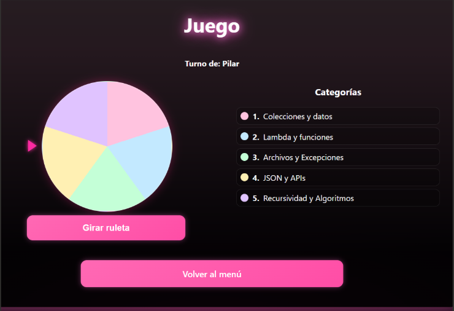
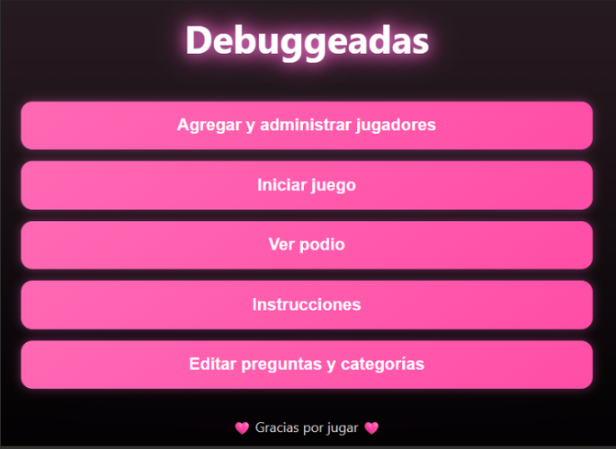
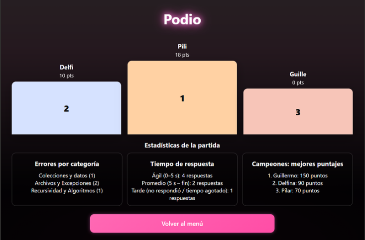

# Debuggeados — Preguntados Ciber

Juego web Full Stack desarrollado individualmente como proyecto académico para Programación III.

Diseñé y desarrollé la aplicación completa, desde la lógica del juego y el backend hasta la interfaz web, la API REST, el sistema de preguntas, estadísticas y despliegue.

El objetivo fue crear una aplicación interactiva de preguntas y respuestas inspirada en juegos como Preguntados y Kahoot, aplicando programación orientada a objetos, modularización, estructuras de datos, APIs REST y persistencia de información.

---

## Vista de la aplicación

### Menú principal



<table>
  <tr>
    <td width="50%">
      <strong>Juego y ruleta de categorías</strong><br><br>
      
    </td>
    <td width="50%">
      <strong>Podio y estadísticas</strong><br><br>
      
    </td>
  </tr>
</table>

---

## Mi desarrollo

Desarrollé de forma integral:

- Frontend con HTML, CSS y JavaScript.
- Backend con Python y FastAPI.
- Diseño e implementación de APIs REST.
- Lógica principal del juego.
- Sistema de jugadores y turnos.
- Ruleta de categorías.
- CRUD de preguntas.
- Persistencia mediante archivos JSON.
- Sistema de puntajes y estadísticas.
- Programación orientada a objetos.
- Modularización del backend.
- Diseño de la interfaz.
- Integración frontend-backend.
- Control de versiones con Git y GitHub.
- Preparación del proyecto para despliegue web.

---

## Tecnologías

**Frontend:** HTML, CSS, JavaScript  
**Backend:** Python, FastAPI  
**API:** REST  
**Persistencia:** JSON  
**Servidor:** Uvicorn  
**Control de versiones:** Git, GitHub  
**Entorno de desarrollo:** Visual Studio Code  
**Deploy:** Railway

---

## Funcionalidades principales

- Agregar y administrar jugadores.
- Iniciar partidas.
- Ruleta de categorías.
- Sistema de turnos.
- Preguntas con cuatro opciones.
- Temporizador de respuesta.
- Validación de respuestas.
- Cálculo automático de puntajes.
- Podio con los tres mejores jugadores.
- Estadísticas de errores por categoría.
- Estadísticas de tiempos de respuesta.
- Administración de preguntas y categorías.
- CRUD completo del banco de preguntas.
- Pantalla de instrucciones.

---

## Categorías

El juego incluye diferentes categorías relacionadas con contenidos de programación:

1. Colecciones y datos
2. Lambda y funciones
3. Archivos y excepciones
4. JSON y APIs
5. Recursividad y algoritmos

---

## Arquitectura del proyecto

El backend se encuentra modularizado para separar responsabilidades:

```text
backend/
├── models.py
├── storage.py
├── game.py
└── main.py
